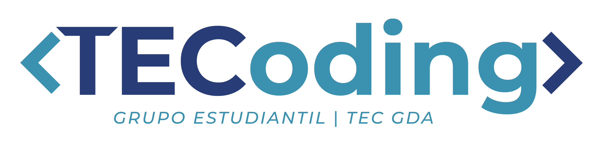

## Hi everyone! We're TECoding 👋

<!-- 📸 We should probably take a photograph to put in here-->

🚀 We're a group of mexican Computer Science students, and our mission is to make tech accessible and interesting for everyone, reaching younger students to join the tech path.
And other CS students can join us to spread the passion and love for tech 🤖♥

🕰We started a year ago as an official student group at the [Tecnológico de Monterrey Campus Guadalajara](https://github.com/tecnologico-de-monterrey-oficial/), but we're looking to impact beyond this and create a community where everyone is welcome! We want to empower developers in México trying to improve their carreers, we want them to grow and learn, but we also want to have fun doing so, together.

## Our projects
- 🎉 [HiTec Quiz App](https://github.com/TECoding/hitec-2021): We created this app so new students at our university could explore new communities and group to improve their school experiences and match them to a group they could be part of.
- 📈 [FETEC App](https://github.com/TECoding/FETEC-APP): We're currently working on an app to showcase local small businesses in the student and entrepeneurs community to help them grow.

## Want to join us?
✨ Sure! Just join our [Discord](https://discord.gg/CJ6guzBXRR)!
Everyone is welcome! And don't be afraid to be yourself 💖

### Useful resources
- Our [Code of Conduct](../CODE_OF_CONDUCT.md).
